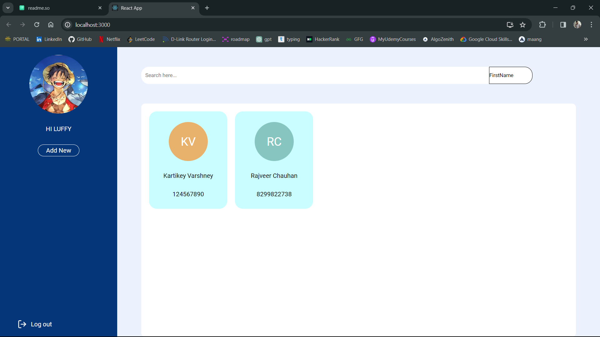
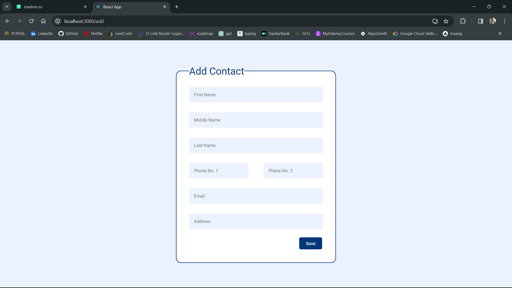
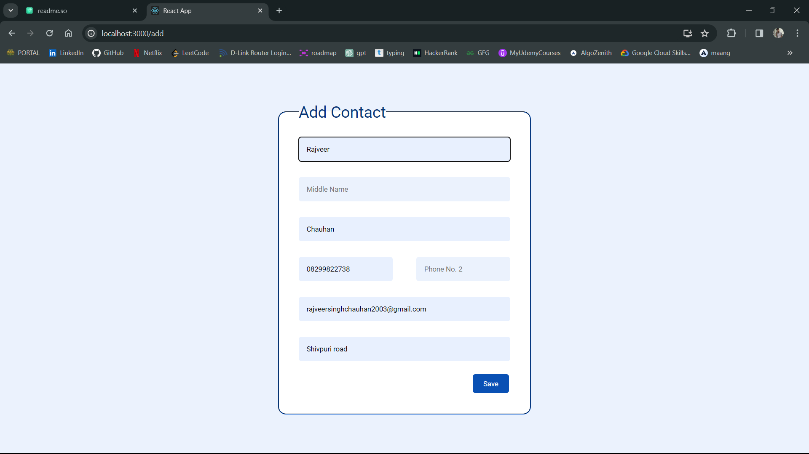
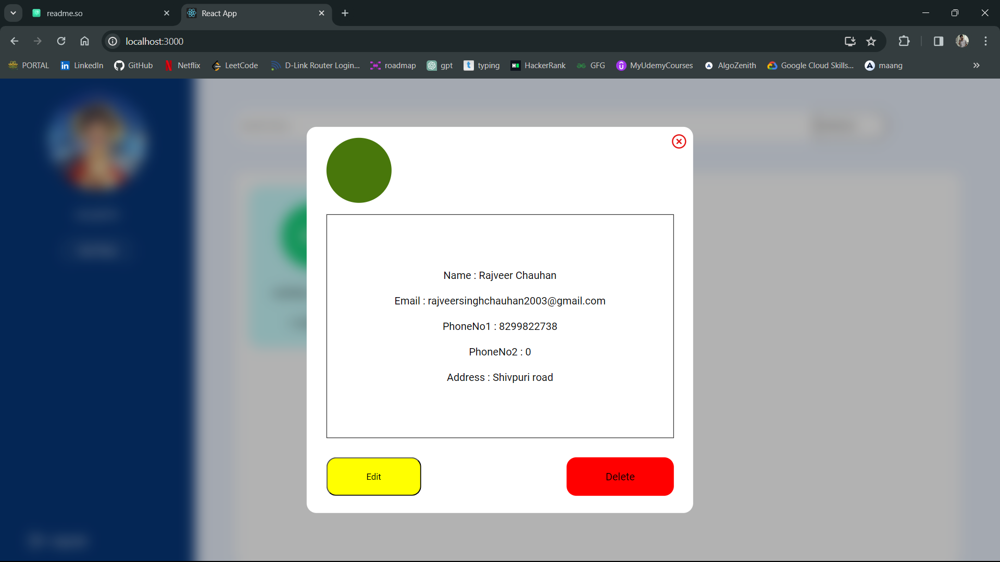
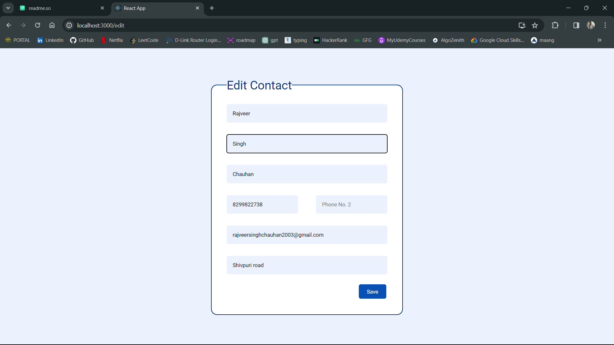
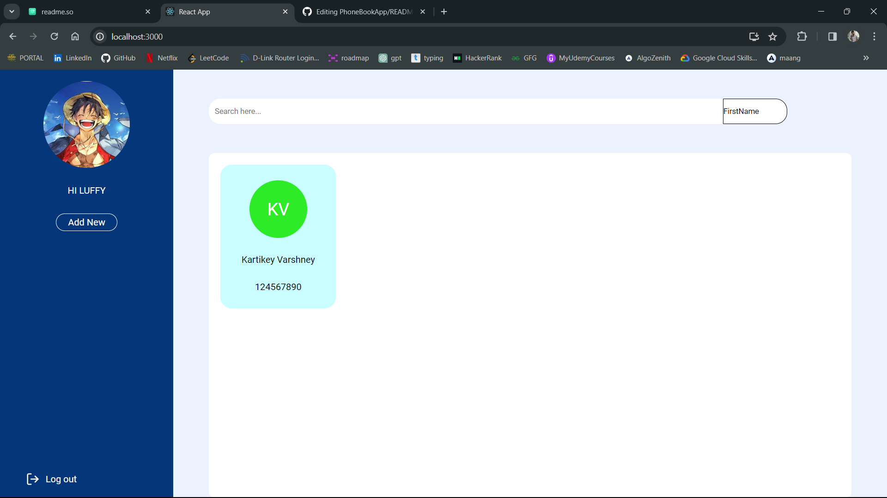
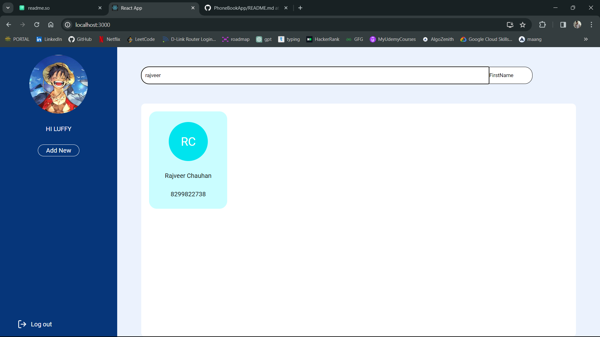

# Phone Book

### Problem Statement:
Develop a web based contact book application that can store following information First name, Middle name, Last name, Email, Phone Number 1, Phone Number 2, Address with the following features:

1. User should be able to add a new contact.
2. User should be able to edit an existing contact.
3. User should be able to view all the contacts in a paginated form
4. User should be able to soft delete a contact.
5. User should be able to search through the contacts by any field and searching any contact should not take more than 1 second.
6. By default, all the contact should be sorted by a Full name.

# Solution

### Dashboard - All the saved contacts are shown here

### Add New Contact

### View Contact

### Edit Contact

### Delete Contact

### Search Contact

